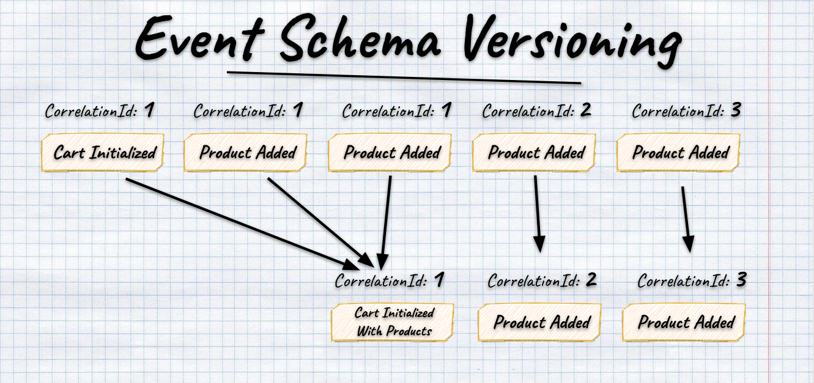

# Event Schema Versioning

- [Event Schema Versioning](#event-schema-versioning)
  - [Simple mapping](#simple-mapping)
    - [New not required property](#new-not-required-property)
    - [New required property](#new-required-property)
    - [Renamed property](#renamed-property)
  - [Upcasting](#upcasting)
    - [Changed Structure](#changed-structure)
    - [New required property](#new-required-property-1)
  - [Downcasters](#downcasters)
  - [Events Transformations](#events-transformations)
  - [Stream Transformation](#stream-transformation)
  - [Summary](#summary)

As time flow, the events' definition may change. Our business is changing, and we need to add more information. Sometimes we have to fix a bug or modify the definition for a better developer experience. 

Migrations are never easy, even in relational databases. You always have to think on:
- what caused the change?
- what are the possible solutions?
- is the change breaking?
- what to do with old data?

We should always try to perform the change in a non-breaking manner. I explained that in [Let's take care of ourselves! Thoughts on compatibility](https://event-driven.io/en/lets_take_care_of_ourselves_thoughts_about_comptibility/) article.

The same "issues" happens for event data model. Greg Young wrote a book about it: https://leanpub.com/esversioning/read. I recommend you to read it.

This sample shows how to do basic Event Schema versioning. Those patterns can be applied to any event store.

You can watch the webinar on YouTube where I'm explaining the details of the implementation:

<a href="https://www.youtube.com/watch?v=fDC465jJoDk" target="_blank"></a>

## Simple mapping

There are some simple mappings that we could handle on the code structure or serialisation level. I'm using `System.Text.Json` in samples, other serialises may be smarter, but the patterns will be similar. 

Having event defined as such:

```csharp
public record ShoppingCartInitialized(
    Guid ShoppingCartId,
    Guid ClientId
);
```

### New not required property

If we'd like to add a new not required property, e.g. `IntializedAt`, we can add it just as a new nullable property. The essential fact to decide if that's the right strategy is if we're good with not having it defined. It can be handled as:

```csharp
public record ShoppingCartInitialized(
    Guid ShoppingCartId,
    Guid ClientId,
    // Adding new not required property as nullable
    DateTime? IntializedAt
);
```

See full sample: [NewNotRequiredProperty.cs](./EventsVersioning.Tests/SimpleMappings/NewNotRequiredProperty.cs).


### New required property

We must define a default value if we'd like to add a new required property and make it non-breaking. It's the same as you'd add a new column to the relational table. 

For instance, we decide that we'd like to add a validation step when the shopping cart is open (e.g. for fraud or spam detection), and our shopping cart can be opened with a pending state. We could solve that by adding the new property with the status information and setting it to `Initialised`, assuming that all old events were appended using the older logic.

```csharp
public enum ShoppingCartStatus
{
    Pending = 1,
    Initialized = 2,
    Confirmed = 3,
    Cancelled = 4
}

public record ShoppingCartInitialized(
    Guid ShoppingCartId,
    Guid ClientId,
    // Adding new not required property as nullable
    ShoppingCartStatus Status = ShoppingCartStatus.Initialized
);
```

See full sample: [NewRequiredProperty.cs](./EventsVersioning.Tests/SimpleMappings/NewRequiredProperty.cs).

### Renamed property

Renaming property is also a breaking change. Still, we can do it in a non-breaking manner. We could keep the same name in the JSON but map it during (de) serialisation.

Let's assume that we concluded that keeping `ShoppingCart` prefix in the `ShoppingCartId` is redundant and decided to change it to `CartId`, as we see in the event name, what cart we have in mind.

We could do it as:

```csharp
public class ShoppingCartInitialized
{
    [JsonPropertyName("ShoppingCartId")]
    public Guid CartId { get; init; }
    public Guid ClientId { get; init; }

    public ShoppingCartInitialized(
        Guid cartId,
        Guid clientId
    )
    {
        CartId = cartId;
        ClientId = clientId;
    }
}
```
See full sample: [NewRequiredProperty.cs](./EventsVersioning.Tests/SimpleMappings/NewRequiredProperty.cs).

## Upcasting

Sometimes we want to make more significant changes or be more flexible in the event mapping. We'd like to use a new structure in our code, not polluted by the custom mappings.

We can use an upcasting pattern for that. We can plug a middleware between the deserialisation and application logic. Having that, we can either grab raw JSON or deserialised object of the old structure and transform it to the new schema. 

### Changed Structure

For instance, we decide to send also other information about the client, instead of just their id. We'd like to have a nested object instead of the flattened list of fields. We could model new event structure as:

```csharp
public record Client(
        Guid Id,
        string Name = "Unknown"
    );

    public record ShoppingCartInitialized(
        Guid ShoppingCartId,
        Client Client
    );
```

We can define upcaster as a function that'll later plug in the deserialisation process. 

We can define the transformation of the object of the old structure as:

```csharp
public static ShoppingCartInitialized Upcast(
    V1.ShoppingCartInitialized oldEvent
)
{
    return new ShoppingCartInitialized(
        oldEvent.ShoppingCartId,
        new Client(oldEvent.ClientId)
    );
}
```

Or we can map it from JSON

```csharp
public static ShoppingCartInitialized Upcast(
    V1.ShoppingCartInitialized oldEvent
)
{
    return new ShoppingCartInitialized(
        oldEvent.ShoppingCartId,
        new Client(oldEvent.ClientId)
    );
}
```

See full sample: [ChangedStructure.cs](./EventsVersioning.Tests/Upcasters/ChangedStructure.cs).

### New required property

We can also solve the same cases as simple mappings, but we have more handling options.

Let's say that we forget to add information about who initialised the shopping cart (user id). We cannot retroactively guess what the user was, but if we were lucky enough to track such information in user metadata (e.g. for tracing), we could try to map it.

```csharp
public record EventMetadata(
    Guid UserId
);

public record ShoppingCartInitialized(
    Guid ShoppingCartId,
    Guid ClientId,
    Guid InitializedBy
);
```

Upcaster from old object to the new one can look like:

```csharp
public static ShoppingCartInitialized Upcast(
    V1.ShoppingCartInitialized oldEvent,
    EventMetadata eventMetadata
)
{
    return new ShoppingCartInitialized(
        oldEvent.ShoppingCartId,
        oldEvent.ClientId,
        eventMetadata.UserId
    );
}
```

From JSON to the object:

```csharp
public static ShoppingCartInitialized Upcast(
    string oldEventJson,
    string eventMetadataJson
)
{
    var oldEvent = JsonDocument.Parse(oldEventJson);
    var eventMetadata = JsonDocument.Parse(eventMetadataJson);

    return new ShoppingCartInitialized(
        oldEvent.RootElement.GetProperty("ShoppingCartId").GetGuid(),
        oldEvent.RootElement.GetProperty("ClientId").GetGuid(),
        eventMetadata.RootElement.GetProperty("UserId").GetGuid()
    );
}
```

See full sample: [NewRequiredPropertyFromMetadata.cs](./EventsVersioning.Tests/Upcasters/NewRequiredPropertyFromMetadata.cs).

## Downcasters

In the same way, as described above, we can downcast the events from the new structure to the old one (if we have the old reader/listener or, for some reason, want to keep the old format).

From the new object to the old one:

```csharp
public static V1.ShoppingCartInitialized Downcast(
    ShoppingCartInitialized newEvent
)
{
    return new V1.ShoppingCartInitialized(
        newEvent.ShoppingCartId,
        newEvent.Client.Id
    );
}
```

From new JSON format to the old object:

```csharp
public static V1.ShoppingCartInitialized Downcast(
    string newEventJson
)
{
    var newEvent = JsonDocument.Parse(newEventJson).RootElement;

    return new V1.ShoppingCartInitialized(
        newEvent.GetProperty("ShoppingCartId").GetGuid(),
        newEvent.GetProperty("Client").GetProperty("Id").GetGuid()
    );
}
```

See full sample: [ChangedStructure.cs](./EventsVersioning.Tests/Upcasters/ChangedStructure.cs).

## Events Transformations

At this point, you may be wondering, "That's nice, but how to connect that with real code?". Let's dive into that.

We'll be plugging between the serialisation and application logic as explained initially. We'll define the class that will contain and process all defined transformations.

```csharp
public class EventTransformations
{
    private readonly Dictionary<string, Func<string, object>> jsonTransformations = new();

    public bool TryTransform(string eventTypeName, string json, out object? result)
    {
        if (!jsonTransformations.TryGetValue(eventTypeName, out var transformJson))
        {
            result = null;
            return false;
        }

        result = transformJson(json);
        return true;
    }

    public EventTransformations Register<TEvent>(string eventTypeName, Func<JsonDocument, TEvent> transformJson)
        where TEvent : notnull
    {
        jsonTransformations.Add(
            eventTypeName,
            json => transformJson(JsonDocument.Parse(json))
        );
        return this;
    }

    public EventTransformations Register<TOldEvent, TEvent>(string eventTypeName, Func<TOldEvent, TEvent> transformEvent)
        where TOldEvent : notnull
        where TEvent : notnull
    {
        jsonTransformations.Add(
            eventTypeName,
            json => transformEvent(JsonSerializer.Deserialize<TOldEvent>(json)!)
        );
        return this;
    }
}
```

We have two `Register` methods. Both of them has JSON and handler function as params. One is used to register the `JsonDocument` raw transformation, the other to register an object to object one. Sample registrations:

```csharp
var transformations = new EventTransformations()
    .Register(eventTypeV1Name, UpcastV1)
    .Register<ShoppingCartInitialized, ShoppingCartInitializedWithStatus>(
        eventTypeV2Name, UpcastV2);
```

We also have `TryTransform` that either transforms JSON into the new object structure or returns `null`. We'll use it further on.

Let's also define the type mapping class responsible for mapping event type name into the CLR type.

```csharp
public class EventTypeMapping
{
    private readonly Dictionary<string, Type> mappings = new ();

    public EventTypeMapping Register<TEvent>(params string[] typeNames)
    {
        var eventType = typeof(TEvent);

        foreach (var typeName in typeNames)
        {
            mappings.Add(typeName, eventType);
        }

        return this;
    }

    public Type Map(string eventType) => mappings[eventType];
}
```

and use it as

```csharp
const string eventTypeV1Name = "shopping_cart_initialized_v1";
const string eventTypeV2Name = "shopping_cart_initialized_v2";
const string eventTypeV3Name = "shopping_cart_initialized_v3";

var mapping = new EventTypeMapping()
    .Register<ShoppingCartInitializedWithStatus>(
        eventTypeV1Name,
        eventTypeV2Name,
        eventTypeV3Name
    );
```

See details in [EventTypeMapping](./EventsVersioning.Tests/Transformations/MultipleTransformationsWithDifferentEventTypes.cs).

It's the most straightforward wrapper that requires manual mapping for all the event types, but it benefits from being explicit and less error-prone. For the convention-based mapper, there is a risk that refactoring accidentally changes the event type name stored in the event store. Still, a viable option is a mixed solution. See more in [EventTypeMapper in the Core project](../../Events/EventTypeMapper.cs)

Having those classes, we can define the final deserialisation logic.

```csharp
public class EventSerializer
{
    private readonly EventTypeMapping mapping;
    private readonly EventTransformations transformations;

    public EventSerializer(EventTypeMapping mapping, EventTransformations transformations)
    {
        this.mapping = mapping;
        this.transformations = transformations;
    }

    public object? Deserialize(string eventTypeName, string json) =>
        transformations.TryTransform(eventTypeName, json, out var transformed)
            ? transformed : JsonSerializer.Deserialize(json, mapping.Map(eventTypeName));
}
```

The logic is simple. It'll either transform JSON through registered transformations (e.g. upcasters or downcasters) or run the regular deserialisation logic.

See a full sample in [MultipleTransformationsWithDifferentEventTypes.cs](./EventsVersioning.Tests/Transformations/MultipleTransformationsWithDifferentEventTypes.cs).

## Stream Transformation

You might want not only to transform a single event into another (1:1) but also a set of events into another one (N:M).

Let's take as an example scenario where we can initialise not only empty shopping cart but also filled with products. For some time, we were doing that by publishing multiple events: `ShoppingCartInitialized` and `ProductItemAddedToShoppingCart` for each added product item. We decided that we'd like to replace this with event containing list of product items:

```csharp
public record ProductItem(
    Guid ProductId,
    int Quantity
);

public record PricedProductItem(
    ProductItem ProductItem,
    decimal UnitPrice
);

public record ShoppingCartInitialized(
    Guid ShoppingCartId,
    Guid ClientId
);

public record ProductItemAddedToShoppingCart(
    Guid ShoppingCartId,
    PricedProductItem ProductItem
);
 
public record ShoppingCartInitializedWithProducts(
    Guid ShoppingCartId,
    Guid ClientId,
    List<V1.PricedProductItem> ProductItems
);
```

We want to process our logic using a new event schema. However, that'd require zipping multiple stream events into a single one. We were lucky enough that we decided to store in metadata correlation id. It's an identifier of the command that initiated business logic. All of the events resulting from the command processing will share the same correlation id.



Using it, we could decide if `ProductItemAddedToShoppingCart` was a part of the initialisation request or not.

We need to take the stream events and transform them into another sequence of events. It could be modeled by such class:

```csharp
public class StreamTransformations
{
    private readonly List<Func<List<EventData>, List<EventData>>> jsonTransformations = new();

    public List<EventData> Transform(List<EventData> events)
    {
        if (!jsonTransformations.Any())
            return events;

        var result = jsonTransformations
            .Aggregate(events, (current, transform) => transform(current));

        return result;
    }

    public StreamTransformations Register(
        Func<List<EventData>, List<EventData>> transformJson
    )
    {
        jsonTransformations.Add(transformJson);
        return this;
    }
}
```

We allow registering multiple transformations. Thanks to that, we can chain them using the `Aggregate` method, taking the previous transformation's result as a base for the next one.

To connect it with the deserialisation process, we need to add it to the `EventSerializer` defined in the previous steps.

```csharp
public class EventSerializer
{
    private readonly EventTypeMapping mapping;
    private readonly StreamTransformations streamTransformations;
    private readonly EventTransformations transformations;

    public EventSerializer(EventTypeMapping mapping, StreamTransformations streamTransformations,
        EventTransformations transformations)
    {
        this.mapping = mapping;
        this.transformations = transformations;
        this.streamTransformations = streamTransformations;
    }

    public object? Deserialize(string eventTypeName, string json) =>
        transformations.TryTransform(eventTypeName, json, out var transformed)
            ? transformed
            : JsonSerializer.Deserialize(json, mapping.Map(eventTypeName));

    public List<object?> Deserialize(List<EventData> events) =>
        streamTransformations.Transform(events)
            .Select(@event => Deserialize(@event.EventType, @event.Data))
            .ToList();
}
```

We're injecting stream transformations into the deserialisation process. We're performing them first before running upcasters or regular deserialisation.

We can implement function doing event grouping as described above as:

```csharp
public List<EventData> FlattenInitializedEventsWithProductItemsAdded(
    List<EventData> events
)
{
    var cartInitialized = events.First();
    var cartInitializedCorrelationId =
        JsonSerializer.Deserialize<EventMetadata>(cartInitialized.MetaData)!
            .CorrelationId;

    var i = 1;
    List<EventData> productItemsAdded = new();

    while (i < events.Count)
    {
        var eventData = events[i];

        if (eventData.EventType != "product_item_added_v1")
            break;

        var correlationId = JsonSerializer
            .Deserialize<EventMetadata>(eventData.MetaData)!
            .CorrelationId;

        if (correlationId != cartInitializedCorrelationId)
            break;

        productItemsAdded.Add(eventData);
        i++;
    }

    var mergedEvent = ToShoppingCartInitializedWithProducts(
        cartInitialized,
        productItemsAdded
    );

    return new List<EventData>(
        new[] { mergedEvent }.Union(events.Skip(i))
    );
}

private EventData ToShoppingCartInitializedWithProducts(
    EventData shoppingCartInitialized,
    List<EventData> productItemsAdded
)
{
    var shoppingCartInitializedJson = JsonDocument.Parse(shoppingCartInitialized!.Data).RootElement;

    var newEvent = new ShoppingCartInitializedWithProducts(
        shoppingCartInitializedJson.GetProperty("ShoppingCartId").GetGuid(),
        shoppingCartInitializedJson.GetProperty("ClientId").GetGuid(), new List<V1.PricedProductItem>(
            productItemsAdded.Select(pi =>
            {
                var pricedProductItem = JsonDocument.Parse(pi.Data).RootElement.GetProperty("ProductItem");
                var productItem = pricedProductItem.GetProperty("ProductItem");

                return new V1.PricedProductItem(
                    new V1.ProductItem(productItem.GetProperty("ProductId").GetGuid(),
                        productItem.GetProperty("Quantity").GetInt32()),
                    pricedProductItem.GetProperty("UnitPrice").GetDecimal());
            })
        )
    );

    return new EventData("shopping_cart_initialized_v2", JsonSerializer.Serialize(newEvent),
        shoppingCartInitialized.MetaData);
}
```

See a full sample in [StreamTransformations.cs](./EventsVersioning.Tests/Transformations/StreamTransformations.cs).

## Summary

I hope that those samples will show you that you can support many versioning scenarios with basic composition techniques.

Nevertheless, the best approach is to [not need to do versioning at all](https://event-driven.io/en/how_to_do_event_versioning/). If you're facing such a need, before using the strategies described above, make sure that your business scenario cannot be solved by talking to the business. It may appear that's some flaw in the business process modelling. We should not be trying to fix the issue, but the root cause.