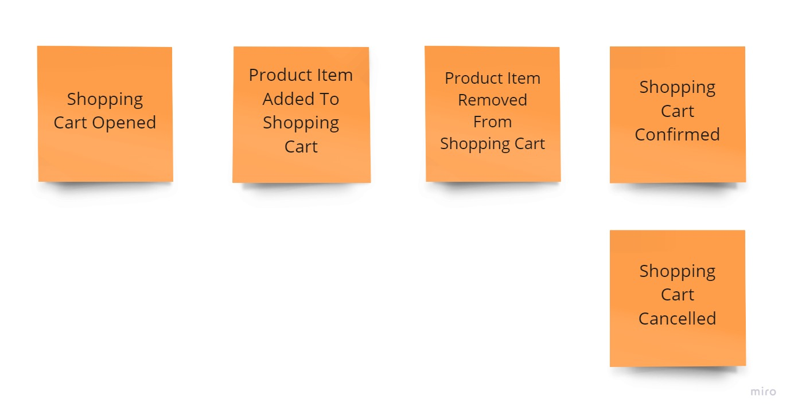

# Exercise 01 - Events Modelling

Having the following shopping cart process:
1. The customer may add a product to the shopping cart only after opening it.
2. When selecting and adding a product to the basket customer needs to provide the quantity chosen. The product price is calculated by the system based on the current price list.
3. The customer may remove a product with a given price from the cart.
4. The customer can confirm the shopping cart and start the order fulfilment process.
5. The customer may also cancel the shopping cart and reject all selected products.
6. After shopping cart confirmation or cancellation, the product can no longer be added or removed from the cart.

Model the events that occur during this process and the entity representing the current state of the shopping cart. Write those events in code. 
Create sample events that represent a specific shopping cart. You can do that in [EventsDefinitionTests](./EventsDefinitionTests.cs) test file.

## Solution

Events model:

There are two alternative solutions:
1. Simple events structure [Solution1/EventsDefinitionTests.cs](./Solution1/EventsDefinitionTests.cs).
2. Events structure with union type to give option to tell that Shopping Cart event is one of the defined types [Solution2/EventsDefinitionTests.cs](./Solution2/EventsDefinitionTests.cs). Read more in [Union types in C#](https://event-driven.io/en/union_types_in_csharp/).
